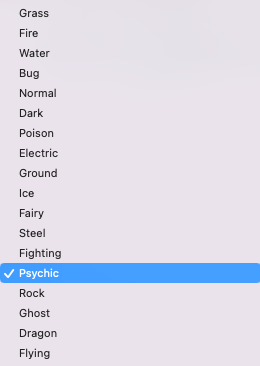

# Interactive_Visualizations-With-Python
**Learning how to create Interactive Visualization Dashboards**

## Overview
**Creating interactive charts to display datasets**

## Bar Plots 
 

## KDE Plots
 
 
 ## Displaying Pokèman Sales

## Table Info using Widgets 
 
